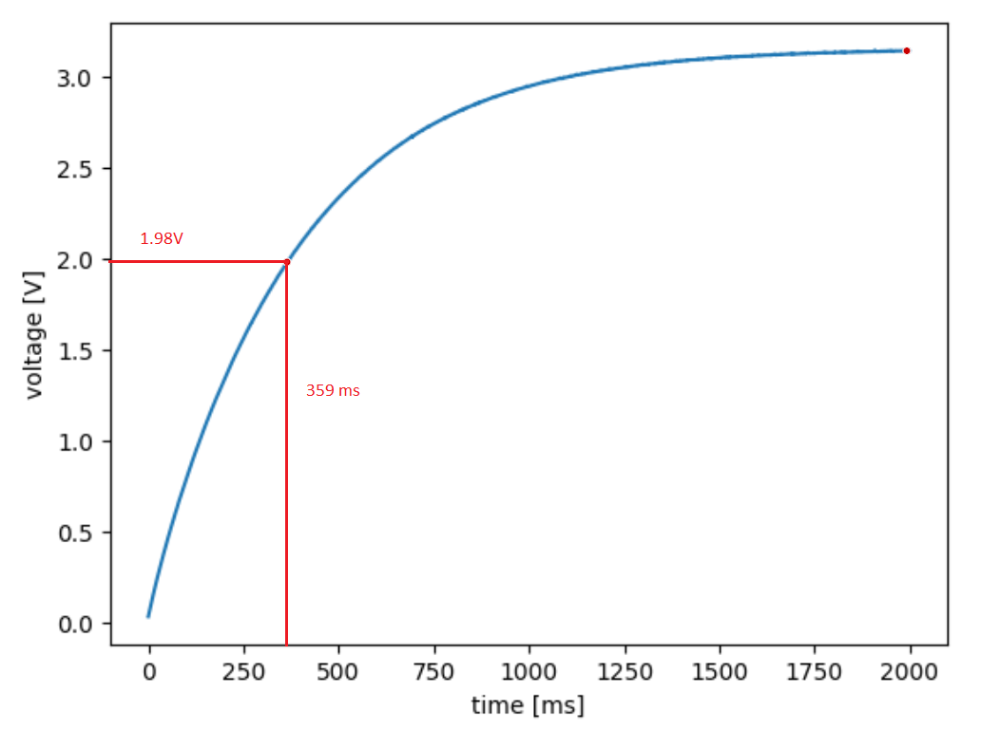

# ME 405 Lab 4: We Interrupt This Program...

## Creating the Interrupts

The purpose of this lab is to familiarize ourselves with the use of interrupts in Python. We create an internal interrupt 
that reads the A/D convertor on pinC0 and then puts this data into a queue for use later. The data stored in the queue is 
limited to a maximum of 1000 16-bit integers. The data we are collecting are ADC values that correspond to a step response 
of an RC circuit with a computed time constant of ~0.3 seconds. Once all the data is collected, we send it through the serial 
port to a PC program that plots the data at a rate of 1 millisecond per point. This plot is then used to graphically determine 
our system time constant and compare the values and see if they are within typical tolerances of electrical components. 

## Step Response Plots
|  |
|:--:|
|**Figure 1: Task Run Rate = 10ms**|